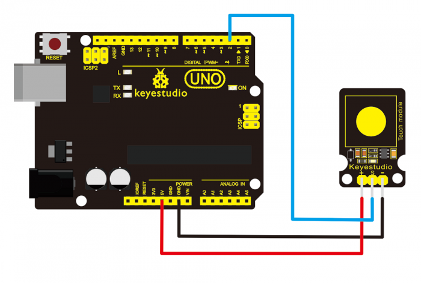
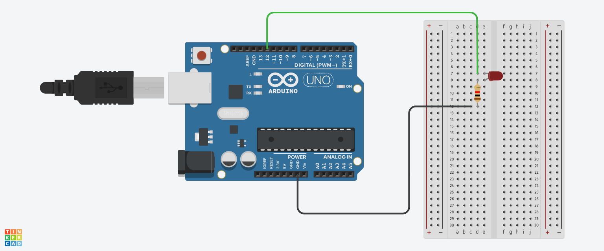

# Touch Sensor

Il Touch Sensor( *sensore tattile* in italiano ) viene spesso utilizzato al posto di pulsanti , é capace di rilevare il cambiamento del *campo elettrico* sulla sua superfice anche quando c' è qualcosa a fare da spessore tra il dito e il sensore. 

## Utilizzo Frequente

Il Touch Sensor viene spesso utilizzato in sostituzione dei pulsanti in `elettrodomestici` (microonde , frigoriferi ,forni e lavatrici ) ma anche in macchinari più complessi nei `sistemi industriali` (per ridurre l' usura dei pulsanti fisici) e spesso nella `domotica`(automazione domestica)

## Composizione Tecnica##

Il Touch Sensor e composto da tre pin:

1.**GDR**(messa a terra)

2.**VCC**(Alimentazione che può essere sia da 3.3V che da 5V )

3.**SIGNAL**(Uscita digitale: High al tocco, Low senza )

4.Parte sensibile del touch(Dove avviene il tocco)

### Progetto

In questo progetto ho usato il Touch Sensor per accendere un **LED** attraverso **Arduino UNO** , può essere utilizzato anche con **Raspberry Pi** (consigliato con **Raspberry** connettere il VCC con la 3.3V )

**Materiali**

1.Arduino UNO

2.Ks0031 Touch Sensor

3.Jumpers/Dupont(Cavi)

4.LED

5.Resistenza(220Ω-330Ω)

6.Breadboard 

**Software**

[Arduino IDE](https://www.arduino.cc/en/software/)

**Codice**

```C
const int touchSensor = 2;  // Pin per Signal del touch


  

void setup() {

    pinMode(touchSensor, INPUT); // imposta il touch come input

    pinMode(12, OUTPUT);        // Imposta LED come output

}

  

void loop() {

    if (digitalRead(touchSensor) == HIGH) { // se il sensore viene toccato

        digitalWrite(12, HIGH); // accendi led 

    } else {

        digitalWrite(12, LOW);  // oppure spegnilo 

    }

}
```

Una volte inserito il codice in Arduino IDE ricordare di salvarlo su Arduino UNO  (il codice può essere scritto in C e C++)

**Passaggi** 
1.Connettere il Touch Sensor con Arduino UNO

- Unire il **GDR** del sensore con un **GDR** di Arduino

- Unire il **VCC** del sensore con 3.3V o 5V di Arduino 

- Unire il **SIGNAL** con l ingresso 2 su Arduino

(Sul sensore ci sono solo le iniziali per ogni pin Es. il **GDR** è segnato con **G**)
A questo punto il LED installato sul sensore dovrebbe accendersi al tocco,
se hai difficolta puoi seguire il tutorial fatto dai produttori cliccando [qui](https://www.keyestudio.com/products/free-shipping-keyestudio-capacitive-touch-sensor-module-for-arduino) 



>Immagine presa dal sito del produttore , le connessioni sono identiche anche su Arduino UNO

2.Connettere il **LED** con con Arduino UNO

- Sulla Breadboard inserire il **LED**

- Inserire una Resistenza da 220Ω ad una delle gambe del **LED** e l' altra su una riga diversa 

- Connettere il **GDR** alla gamba esterna della resistenza (l' opposta del led), dall' altra parte con l' ingresso **SIGNAL** 12 di Arduino UNO connettersi alla gamba opposta del **LED**



>Immagine prodotta da me utilizzando l' editor di  [Tinkercad](https://www.tinkercad.com/)
>utile per provare programmi e progetti 

3.Caricare il codice

- Aperto Arduino IDE potete copiare il mio codice o scriverlo da soli , il linguaggio usato è C/C++

- Caricarlo su Arduino UNO ed il gioco è fatto 

Adesso toccando il sensore il **LED** si accenderà , l' utilizzo del sensore sono ovviamente sono infinite il limite è la tua fantasia.

**INFORMAZIONI**

L' ingresso dei pin può essere modificato a piacimento , basta ricordarsi di cambiarlo anche nel codice

Il produttore del sensore è la [Keyestudios](https://www.keyestudio.com/)produce diversi sensori di buona qualità

Il sensore usato è il Ks0031 e cliccando [qui](https://wiki.keyestudio.com/Ks0031_keyestudio_Capacitive_Touch_Sensor) puoi andare alla wiki di quest' ultimo 

La versione di Arduino IDE è la 2.3.4 e può essere scaricata [qui](https://www.arduino.cc/en/software/)

La versione di Arduino UNO è la R3

I cavi la breadboard e i led possono essere acquistati facilmente oppure acquistando lo Starter Kit
di Arduino UNO li troverai nella scatola assieme ad altri sensori e motori  

Davide Salerno 02/04/2025
 


